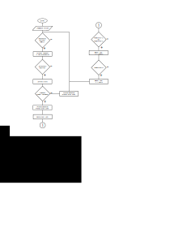

# PROJEKT
## STM8
Startovací strom zdrojových kódů pro výuku mikroprocesorové techniky s kitem
[NUCLEO-8S208RB](https://www.st.com/en/evaluation-tools/nucleo-8s208rb.html).
Strom je určen pro překladač [SDCC](http://sdcc.sourceforge.net/). Standardní
knihovnu pro práci s periferiemi 
[SPL](https://www.st.com/content/st_com/en/products/embedded-software/mcu-mpu-embedded-software/stm8-embedded-software/stsw-stm8069.html)
je třeba (z licenčních důvodů) stáhnou zvlášť ze stránek výrobce a použít
[patch](https://github.com/gicking/STM8-SPL_SDCC_patch).

## Popis:
Projekt představuje indikaci stavu baterie.
Skládá se z několika periferií: rotační n-kodér, NeoPixel modul s 8 RGB LED WS2812, LCD displej HD44780.
Všechny tyto periferie jsou drátově propojeny s STM8 kitem na nepájivém poli.
K napájení nám stačí USB / micro-USB kabel, který napájí STM8 kit napětím 5V. Všechny ostatní periferie budou napájeny přímo z kitu. 
Kód využívá tlačítka přímo na kitu (USER, RESET), ale je možné použít i externě zapojená tlačítka. 

## Součástky:
 ### rotační n-kodér 
- Udává aktuální stav. Při rotaci bude nabývat hodnot 0-100. 
### LED modul WS2812 
- Modul obsahuje 8 LED diod. Programujeme je pomocí dátového výstupu MOSI. Pomocí 3 bitů na každé ledce nastavujeme barvu a jas.
- Modul vizuálně indikuje stav baterie jak barvou, tak počtem rozvícených diod.
### LCD displej HD44780 
- K tomuto displeji je přímo knihovna (stm8_hd44780.h, stm8_hd44780.c). Jas displeje je regulovaný pomocí potenciometru 5kΩ, který je připojený na nepájivém poli. 
    #### Zapojení:
    * K STM8 připojíme datové piny D4-D7. Piny D0-D3 necháme nezapojené.
    *  Dále k STM8 připojíme vstupy RS, RW, E.
    * Piny zřejmě musíme zapojit přesně tak, jak jsou zapojeny v tomto projektu. Při jiném zapojení mi displej nefungoval.
    * Zapojíme pyny pro nápájení na VDD na +5V a VDD na GND.
    * Společnou anodu (A) zapojíme také na +5V a společnou katodu (K) přes ochranný rezistor (použitý 560Ω) na GND.
    * Pin V0 slouží pro podsvícení displeje. Tento jas regulujeme pomocí potenciometru, jehož oba konce jsou zapojeny na napájecí svorky a jezdec je připojený na pin V0 (viz. schéma).
       
```
        #define LCD_RS_PORT GPIOF
        #define LCD_RW_PORT GPIOF
        #define LCD_E_PORT GPIOF
        #define LCD_D4_PORT GPIOG
        #define LCD_D5_PORT GPIOG
        #define LCD_D6_PORT GPIOG
        #define LCD_D7_PORT GPIOG

        #define LCD_RS_PIN GPIO_PIN_7
        #define LCD_RW_PIN GPIO_PIN_6
        #define LCD_E_PIN GPIO_PIN_5
        #define LCD_D4_PIN GPIO_PIN_0
        #define LCD_D5_PIN GPIO_PIN_1
        #define LCD_D6_PIN GPIO_PIN_2
        #define LCD_D7_PIN GPIO_PIN_3
```
### Tlačítko USER 
- je zabudované na kitu s STM8. Při stisku se hodnota stavu baterie skokově sníží o 10%.

## Popis funkce:
* Po startu se výchozí hodnota nastaví na 100. Tato hodnota je ukázána na LCD displeji jako 100%.
* Na LED modulu se rozvítí všech 8 diod zelenou barvou.
* Na výběr máme 3 možnosti interakce:
    1. Pomocí rotačního enkodéru můžeme měnit hodnotu 0-100.
    2. Stiskem tlačítka USER, které sníží hodnotu o 10%, ale maximálně na hodnotu 0.
    3. Při stisku tlačítka enkodéru se spustí časovač, který každých 200 milisekund odebere z hodnoty 1%. 
* Podle snížené hodnoty se postupně shasínají LED diody  (každých 13% 1 LED dioda), mění se barva (od 50%-15% oranžová, 15%-1% červená).
* Hodnota na displeji se mění na danou hodnotu.
* Při snížení hodnoty na 0 budou všechny LED diody zhasnuté. 
* Při stisku tlačítka USER, když hodnota je 0, se rozbliká jedna červená dioda a po chvíli zase zhasne, zároveň se na displeji zobrazí text "BATTERY IS DEAD".
* Pokud je aktivovaný časovač pomocí n-kodéru, můžeme ho zastavit dalším stisknutím.
* Při stisku tlačítka enkodéru, když hodnota je 0%, se na displeji objeví na 1,5s nápis "FULL BATTERY" a hodnota se resetuje na 100%.

## Blokové schéma:


## Schéma:


## Vývojový diagram:


## Zhodnocení:
* Sestavený projekt simuluje stav baterie s nastavením hodnoty. Používá periferie jako LCD displej, LED modul a enkodér. Využívá funkce **milis** a **delay**.
* **Výhody:** 
    * Všechny známé chyby, co by mohly nastat jsou opravené. 
    * Program má mnoho možností, jak pracovat s hlavním parametrem. 
    * Podmínky programu jsou psány dostatečně jednoduše a relativně jsou lehce pochopitelné. 
* **Nevýhody:**
    * Snažil jsem se přidat více možností, jak pracovat s parametry, jako například ovládání podržením tlačítka, ale i přes snahu najít informace a po mnoho pokusech se mi nepodařilo tyto funkce zavést, aniž by to fungovalo s ostatními podmínkami kódu.
    * Kód je psaný velice jednoduše a některé části by se daly určitě zkrátit a použít složitější funkce.
* Kód je dostatečně dlouhý a propracovaný, obsahuje dost periferií, avšak mohly by být více rozvinuté a mít více funkcí v kódu.
* Během programování jsem daleko lépe pochopil funkčnost některých částí kódu. Bohužel jsem se musel vypořádat i s takovými částmi, které jsem nedokázach pochopit. Naučil jsem se používat periferie enkodér a LED modul WS2812. Kdybych měl více času se zaměřit na programování s STM8 určitě bych dokázal naprogramovat zajímavé programy, ale potřeboval bych mít nějakou inspirac, či zadání funkce programu. Problém by byl v tom, že nedokážu naprogramovat složitější funkce a špatně je chápu. Další demotivací je pro mě, že programování v jazyce C ke svému účelu nevyužiji, využívám ho jen pro předmět mikroprocesorová technika. Na programování pro vlastní účely bych využil, pokud je to možné, jazyk Python.

# Dokumenty:
[here](docs/)


autor: Tomáš Smida